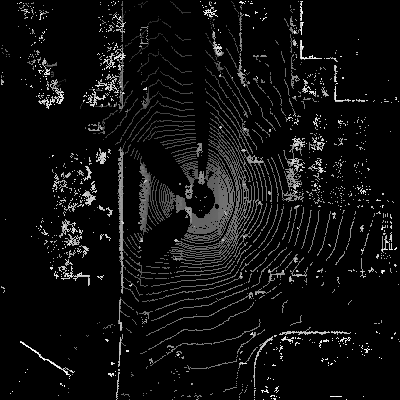
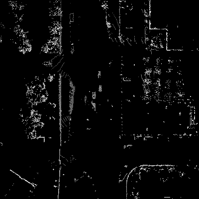

# Ground Removal


This is an implement of **Fast Segmentation of 3D Point Clouds for Ground Vehicles** [1].

The BEV module in `toolbox` is generously contributed by Ronny and Dr Kevin [2] [3].

We use a lidar image `img\kitti_sample.pcd` from the [KITTI dataset](http://www.cvlibs.net/datasets/kitti/) as a test for this algorithm [4].


## Performance
### Before removal


### After removal


## Usage

### Step 1: load the local point cloud

```python
import pcl
import numpy as np
vel_msg = np.asarray(pcl.load('img/kitti_sample.pcd'))
vel_msg = vel_msg * np.array([1,1,-1]) # revert the z axis
```
The input of the module is `numpy.ndarray` type. Make sure to convert the data type when loading the cloud points.

Notes: the Velodyne LiDAR sensor is installed upside down in the NCLT and KITTI dataset.

### Step 2: Segment the ground from the local point cloud

```python
from module.ground_removal import Processor

process = Processor(n_segments=70, n_bins=80, line_search_angle=0.3, max_dist_to_line=0.15,
                    sensor_height=1.73, max_start_height=0.5, long_threshold=8)
vel_non_ground = process(vel_msg)
```

### Step 3:Generate BEV image

```python
from module import lidar_projection
import cv2

img_raw = lidar_projection.birds_eye_point_cloud(vel_msg,
                                                 side_range=(-50, 50), fwd_range=(-50, 50),
                                                 res=0.25, min_height=-2, max_height=4)
cv2.imwrite('img/kitti_raw.png', img_raw)


img_non_ground = lidar_projection.birds_eye_point_cloud(vel_non_ground,
                                                        side_range=(-50, 50), fwd_range=(-50, 50),
                                                        res=0.25, min_height=-2, max_height=4)
cv2.imwrite('img/kitti_non_ground.png', img_non_ground)
```


## Detail Usage

```
Module: Processor

Args:
    n_segments(int): The number of fan-shaped regions divided by 360 degrees
    n_bins(int): The number of bins divided in a segment.
    r_max(float): The max boundary of lidar point.(meters)
    r_min(float): The min boundary of lidar point.(meters)
    line_search_angle(float): The angle for relative search in nearby segments.
    max_dist_to_line(float): The distance threshold of the non-ground object to the ground.(meters)

    max_slope(float): Local maximum slope of the ground.
    max_error(float): The max MSE to fit the ground.(meters)
    long_threshold(int): The max threshold of ground wave interval.
    max_start_height(float): The max height difference between hillside and ground.(meters)
    sensor_height(float): The distance from the lidar sensor to the ground.(meters)

Call:
    Arg:
        vel_msg(numpy.ndarray): The raw local LiDAR cloud points in 3D(x,y,z).
        
        For example:
            vel_msg shapes [n_point, 3], with `n_point` refers to the number of cloud points, 
                while `3` is the number of 3D(x,y,z) axis.
            vel_msg = array([[0.3, 0.1, 0.7],
                             [0.6, 0.6, 0.5],
                             [0.1, 0.4, 0.8],
                              ...  ...  ...
                             [0.5, 0.3, 0.6],
                             [0.6, 0.3, 0.4]]
    Returns:
        vel_non_ground(numpy.ndarray):  The local LiDAR cloud points after filter out ground info.
```

## Reference

[1] Himmelsbach, M., Hundelshausen, F.V. and Wuensche, H.J., 2010, June. Fast segmentation of 3D point clouds for ground vehicles. In 2010 IEEE Intelligent Vehicles Symposium (pp. 560-565). IEEE.

[2] Ronny., (2017). Lidar Birds Eye Views [online]. Ronny. Available from: http://ronny.rest/blog/post_2017_03_26_lidar_birds_eye

[3] Sun, L., Adolfsson, D., Magnusson, M., Andreasson, H., Posner, I. and Duckett, T., 2020, May. Localising Faster: Efficient and precise lidar-based robot localisation in large-scale environments. In 2020 IEEE International Conference on Robotics and Automation (ICRA) (pp. 4386-4392). IEEE.

[4] Geiger, A., Lenz, P., Stiller, C. and Urtasun, R., 2013. Vision meets robotics: The kitti dataset. The International Journal of Robotics Research, 32(11), pp.1231-1237.
